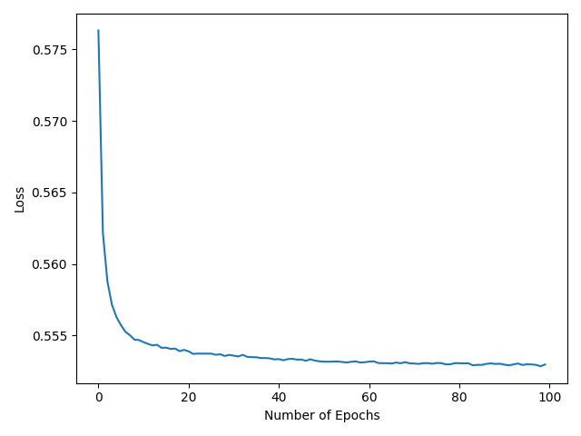

# AutoEncoder

## Trained Molels

| Dataset      | input size         | embedding size | Epochs | MAE     | SSIM    | PSNR     |
| ------------ | ------------------ | -------------- | ------ |-------- | ------- | -------- |
| MNIST        |  784 (1 x 28 x 28) |           128  |    100 | 0.01243 | 0.97430 | 28.90812 |
| FashionMNIST |  784 (1 x 28 x 28) |           256  |    100 | 0.03101 | 0.90342 | 25.99945 |
| CIFAR10      | 3072 (1 x 32 x 32) |          1024  |    100 | 0.02690 | 0.93575 | 29.36889 |

## Evaluation

### [MNIST](https://docs.pytorch.org/vision/stable/generated/torchvision.datasets.MNIST.html)


### [FashionMNIST](https://docs.pytorch.org/vision/stable/generated/torchvision.datasets.FashionMNIST.html)


### [CIFAR10](https://docs.pytorch.org/vision/main/generated/torchvision.datasets.CIFAR10.html)




## How to write a configuration file

```yaml:source/config/autoencoder.yaml
dataset_path: /dataset/directory/path/  # dataset path (see `source/autoencoders/dataloader.py`).
width: 28  # Shape of the input image.
height: 28
channel: 1
embedding_size: 128  # The number of dimensions of the embedded representation.
max_epochs: 100  # Number of epochs.
batch_size: 64  # Batch_size
num_workers: 8  # How many subprocesses to use for data loading (see `torch.utils.data.DataLoader`).
device: cuda  # device name.
output_dir_path: output/dir/path/  #  Directory for storing network training and evaluation results.
model_filename: model_filename.pth  # File of traind model.
```
